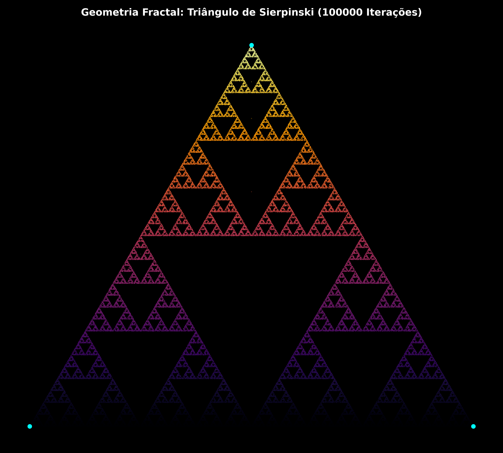

# Modelagem Matemática e Geometria Computacional de Fractais 🌌📐

Este repositório apresenta um algoritmo em Python desenvolvido no Google Colab para modelar e renderizar estruturas matemáticas complexas auto-similares (Fractais), especificamente o Triângulo de Sierpinski, através do método estocástico do Jogo do Caos (*Chaos Game*).

## Como Funciona o Algoritmo Recursivo?
A mecânica por trás da imagem gerada segue uma lógica matemática puramente iterativa de três passos básicos:
1. Definem-se três pontos fixos no plano que servem como os vértices de um triângulo equilátero.
2. Sorteia-se um ponto de partida inicial qualquer dentro do espaço bidimensional.
3. Entra-se em um loop repetitivo de alta performance (100.000 iterações), onde a cada passo o algoritmo sorteia aleatoriamente um dos três vértices e plota o próximo ponto exatamente na metade da distância entre o ponto atual e o vértice escolhido.

---

## Justificativa Teórica

### 1. Caos Gerando Ordem Estrita
O paradoxo fascinante deste projeto reside na Teoria do Caos. Embora as decisões de qual direção tomar a cada linha de código sejam 100% aleatórias (`np.random.randint`), o resultado final acumulado não se torna um borrão desordenado. A restrição geométrica da equação força os pontos a convergirem para um atrator estranho perfeitamente ordenado, demonstrando como leis microscópicas simples governam padrões macroscópicos complexos.

### 2. Dimensão Fracionária (Hausdorff)
Geometrias euclidianas tradicionais possuem dimensões inteiras (uma linha tem dimensão 1, um plano tem dimensão 2). Fractais quebram essa regra. O Triângulo de Sierpinski possui uma Dimensão de Hausdorff de aproximadamente **1.585**, o que significa matematicamente que ele ocupa mais espaço do que uma linha unidimensional pura, porém menos espaço do que uma superfície bidimensional preenchida, devido aos seus infinitos buracos internos.

---

## 🛠️ Tecnologias Utilizadas
* **Python 3**
* **NumPy:** Vetorização e manipulação de matrizes de coordenadas de alta velocidade.
* **Matplotlib:** Renderização gráfica customizada com mapas de cores dinâmicos (`cmap='inferno'`) em modo de renderização escuro.

---

## 📈 Resultados Obtidos
Ao processar 100.000 iterações de coordenadas espaciais vetoriais, o algoritmo produz uma estrutura geométrica de altíssima fidelidade. A variação de cores reflete a altitude (eixo Y) dos pontos gerados:

---

## 🔍 Interpretação dos Resultados e Aplicações Práticas

Embora pareça uma construção puramente artística, a modelagem de estruturas fractais e sistemas dinâmicos possui profundas ramificações no ecossistema de dados moderno:

### 1. Modelagem de Séries Temporais Financeiras
Os mercados financeiros e as variações de preços de ativos da B3 não seguem curvas suaves; eles exibem propriedades auto-similares (fractais). Um gráfico de 5 minutos de uma ação frequentemente se assemelha estatisticamente ao gráfico de base diária ou semanal do mesmo ativo. Compreender algoritmos que geram fractais é a base para o desenvolvimento de modelos de **Geometria Fractal das Finanças** (propostos por Benoit Mandelbrot) para prever caudas longas e riscos extremos que modelos gaussianos tradicionais ignoram.

### 2. Compressão de Dados e Computação Gráfica
A geração do triângulo prova que é possível armazenar imagens infinitamente complexas utilizando apenas algumas poucas linhas de equações matemáticas determinísticas. Esse conceito é amplamente aplicado em algoritmos de compressão fractal de imagens e geração de terrenos/cenários procedurais realistas na indústria de computação gráfica e simulações físicas.

### 3. Eficiência de Código Vetorizado (Numpy vs Loops Tradicionais)
A computação e plotagem de 100.000 pontos de forma quase instantânea demonstra a eficiência da vetorização em Python. Estruturar o armazenamento das coordenadas em matrizes bidimensionais do NumPy simula o fluxo de computação pesada exigido no treinamento de modelos de redes neurais ou em simulações estatísticas de Monte Carlo.

---

## 🧠 Competências Demonstradas
* Lógica algorítmica avançada e modelagem matemática/estocástica.
* Computação científica utilizando arrays eficientes e vetorizados com NumPy.
* Customização gráfica avançada no Matplotlib para exibição de análises geométricas de alta qualidade.

---

## 🚀 Como Executar o Projeto
1. Abra o arquivo `.ipynb` deste repositório diretamente no seu **Google Colab**.
2. Execute todas as células (`Ctrl + F9`). A imagem em alta definição `fractal_sierpinski.png` será salva na barra de arquivos lateral do ambiente.
